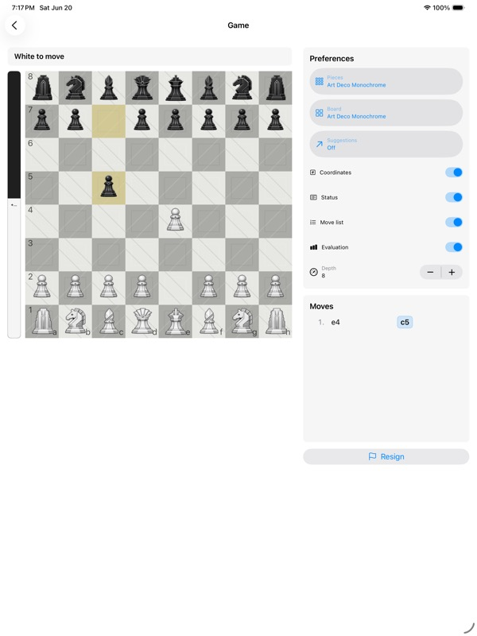
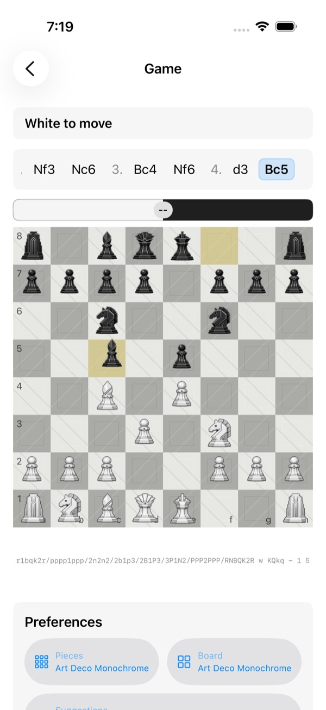

# SwiftChessDemo

SwiftChessDemo is a demo app that demonstrates how to combine local chess
libraries into a realistic, shippable SwiftUI chess experience.
The code is intentionally small, readable, and heavily commented so you can
trace how each module contributes to the final behavior.
It is intended as a reference implementation for building an app with
SwiftChessTools, not as a minimal sample.

Licensing note: SwiftChessDemo's original source code is licensed under the MIT
License so it can be reused as reference app code. The default app target links
with Stockfish through `../StockfishEmbedded`; distributing that combined
Stockfish-linked app requires GPLv3 compliance. The app can also use the
permissively licensed `ArasanEmbedded` Swift package as a second embedded engine.
See `LICENSE`, `LICENSES/`, and `THIRD_PARTY.md` for details.

## Screenshots

The demo is designed to show the same app-owned chess experience adapting
between regular-width iPad layouts and compact iPhone layouts.

<p>
  
</p>

<p>
  
</p>

## Setup

Public checkout layout:

SwiftChessDemo expects `SwiftChessTools` and `StockfishEmbedded` to be sibling
checkouts. It resolves `ArasanEmbedded` from GitHub through Swift Package
Manager. The parent folder can be any local directory; it does not need to be a
Git repo.

```sh
mkdir swift-chess-demo-dev
cd swift-chess-demo-dev

git clone https://github.com/Trickfest/SwiftChessDemo.git
git clone https://github.com/Trickfest/SwiftChessTools.git
git clone https://github.com/Trickfest/StockfishEmbedded.git
```

The resulting layout should be:

```text
swift-chess-demo-dev/
|-- SwiftChessDemo
|-- SwiftChessTools
`-- StockfishEmbedded
```

Required after clone: initialize the sibling `../StockfishEmbedded` checkout
using its NNUE setup instructions. Those Stockfish neural-net files are not in
Git because they are large, but they are required to run the engine.

```
(cd StockfishEmbedded && Scripts/download-nnue.sh)
```

See `../StockfishEmbedded/README.md` or
`../StockfishEmbedded/Resources/NNUE/README.md` for the authoritative engine
asset setup. SwiftChessDemo intentionally does not duplicate the exact NNUE
filename because it changes when StockfishEmbedded updates vendored Stockfish.

How it all fits together:
- `ChessCore` owns board state, legal move generation, move application, PGN
  parsing, FEN serialization, SAN move records, game status, and draw claims.
- `ChessUI` renders the board and emits user move gestures. It also supplies
  the visible chessboard components used by the demo: piece sets, board
  themes, coordinate labels, `ChessGameStatusView`, `ChessMoveListView`,
  `ChessEvaluationBar`, and app-supplied `ChessBoardArrow` suggestions.
- `ChessUCI` formats UCI command strings and parses `info` and `bestmove`
  lines into typed values.
- SwiftChessDemo owns app policy: view-model state, engine timing, move-provider
  selection, user display preferences, recoverable engine status feedback,
  error handling, and when validated moves should mutate the game.
- `StockfishMoveProvider` wraps the embedded Stockfish lifecycle and serialized
  UCI searches for live play.
- `ArasanMoveProvider` wraps the embedded Arasan lifecycle and the same
  serialized UCI search contract for live play.
- `ScenarioReplayMoveProvider` supplies deterministic non-live-engine moves for
  scenario replay and scenario-backed tests.
- The sibling `../StockfishEmbedded` project supplies engine moves over the UCI
  protocol via `SFEngine`.
- The `ArasanEmbedded` Swift package supplies an alternative engine over the UCI
  protocol via `ArasanEngine`.

Data flow at a glance:
- User moves on the board -> `ChessUI` -> `GameViewModel.handleUserMove`.
- The move is validated/applied in `ChessCore`, then serialized to FEN.
- FEN is pushed back into `ChessUI` to update the board UI.
- Terminal game state and claimable draws are read from ChessCore's
  `Game.status` and draw-claim APIs, then rendered with `ChessGameStatusView`.
- Legal moves are also captured as `ChessMoveRecord` values before they are
  applied, so `ChessMoveListView` can render SAN without owning the game.
- When it is the engine's turn, the selected live engine provider uses
  `ChessUCI` to format the UCI `position` and `go` command strings sent to the
  embedded engine.
- Opponent searches start immediately after the user's move. SwiftChessDemo
  keeps a minimum visible thinking interval before applying very fast replies,
  but it does not add that interval on top of slower real searches.
- The selected live engine streams `info` lines through its provider, where
  `ChessUCI` parses them into White-positive evaluation values for
  `ChessEvaluationBar`.
- If a live engine search reaches the demo timeout, SwiftChessDemo asks the
  engine to stop, applies the returned `bestmove` when available, and uses the
  existing status display for a brief nonfatal notice that the timeout fallback
  was used before returning to the normal game status.
- When suggestions are enabled, SwiftChessDemo asks the selected engine for up
  to three MultiPV analysis lines on the human player's turn, caches the ranked
  first moves, and filters the visible ChessUI arrows according to the user's
  suggestion-count picker. ChessUI renders the arrows but does not decide which
  moves to suggest.
- The engine returns `bestmove`; `ChessUCI` parses it into a `ChessCore.Move`.
- Scenario replay uses a named JSON scenario plus a bundled PGN fixture. The
  PGN is parsed through `ChessCore.PGNSerializer`, concrete moves are held in
  memory, and the same move-application path updates the board, move list, and
  status UI without starting a live engine.

Reference-app boundaries:
- SwiftChessTools provides reusable chess building blocks; SwiftChessDemo shows
  one app-owned composition of those blocks.
- ChessUI renders app-supplied state. It does not decide legal policy, own the
  game model, run engines, choose suggestion moves, or apply moves on behalf of
  the app.
- ChessUCI formats and parses protocol text. It does not start an engine,
  serialize searches, choose depth or MultiPV policy, or decide how analysis
  should affect UI.
- Stockfish integration lives in the default app target through
  `StockfishEmbedded`. That linked distribution must comply with GPLv3.
  `ArasanEmbedded` is also available from the same game screen as a
  permissively licensed engine option.
- The scenario system is an app-level test and demonstration harness, not a
  SwiftChessTools public API.

Key files to read:
- `SwiftChessDemo/ContentView.swift`: configuration UI for choosing the human side.
- `SwiftChessDemo/GameView.swift`: board UI, live piece-set, board-theme,
  engine-selection, and coordinate-label switching during play, visible ChessUI
  status and move-list components, status-row engine activity and timeout
  notices, optional evaluation-bar display, in-game engine-depth control,
  selectable move-suggestion arrows, compact horizontal move-list layout on
  iPhone, and navigation flow.
- `SwiftChessDemo/GameViewModel.swift`: display state, safe move application,
  provider event handling, minimum-visible-thinking timing, recoverable timeout
  fallback, evaluation normalization, selected-engine MultiPV suggestion
  mapping, and ChessCore game-status integration.
- `SwiftChessDemo/StockfishMoveProvider.swift`: embedded Stockfish lifecycle,
  serialized search requests, UCI command formatting/parsing, timeout `stop`
  handling, and cancelled suggestion-output handling.
- `SwiftChessDemo/ArasanMoveProvider.swift`: embedded Arasan lifecycle,
  serialized search requests, UCI command formatting/parsing, timeout `stop`
  handling, and cancelled suggestion-output handling.
- `SwiftChessDemo/DemoEngineProvider.swift`: app-local engine abstraction and
  shared request/event models used by live engine providers.
- `SwiftChessDemo/GameScenario.swift`: scenario-file loading and PGN validation
  for deterministic replay fixtures.
- `SwiftChessDemo/GameScenarioIndex.swift`: bundled scenario catalog loading and
  validation used to catch scenario-resource drift.
- `SwiftChessDemo/GameMoveProvider.swift`: deterministic move-provider
  abstraction used by scenario replay and scenario-backed UI tests.
- `SwiftChessDemo/Scenarios/`: checked-in scenario index, authoring guide, JSON
  definitions, and PGN fixtures.
- `SwiftChessDemoTests/GameScenarioUnitTests.swift`: fast unit coverage for
  scenario loading, index validation, and deterministic move-provider behavior.
- `SwiftChessDemoUITests/SwiftChessDemoUITests.swift`: UI coverage for available
  in-game piece-set selection, board-theme selection, coordinate-label toggling,
  live-engine selection, status, move-list, evaluation display options,
  selectable suggestion arrows, scenario replay, and four-full-move game flows
  from both white and black perspectives.

Automated tests:
- Run the suite from this repo root:

```sh
xcodebuild -project SwiftChessDemo.xcodeproj \
  -scheme SwiftChessDemo \
  -configuration Debug \
  -destination 'platform=iOS Simulator,name=iPhone 17 Pro' \
  -derivedDataPath .build/xcode-swiftchessdemo \
  -clonedSourcePackagesDirPath .build/xcode-swiftchessdemo/SourcePackages \
  test
```

- GitHub Actions runs the app-hosted unit tests after checking out
  `SwiftChessDemo`, `SwiftChessTools`, and `StockfishEmbedded` as siblings,
  resolving `ArasanEmbedded`, and downloading the Stockfish NNUE file. The full
  UI suite is the local release gate because hosted simulator UI tests are
  slower and more environment sensitive.
- The shared local scheme includes both fast scenario unit tests and full UI
  tests. The unit tests run inside the demo app host so `Bundle.main` loads the
  same bundled scenarios the app uses at runtime.
- Scenario replay tests set `SWIFT_CHESS_DEMO_SCENARIO=<scenario-id>` and
  optionally `SWIFT_CHESS_DEMO_SCENARIO_REPLAY_DELAY=0`. Each scenario id maps
  to a JSON file in `SwiftChessDemo/Scenarios`; the JSON points at the PGN
  fixture that supplies the validated move list.
- The game-flow UI tests run named scenarios in `testDrivesWhite` or
  `testDrivesBlack` mode so one side is driven by UI-test taps while the
  scenario supplies the opposing replies. This keeps move-flow coverage
  deterministic without starting a live engine.
- The game-flow tests set `SWIFT_CHESS_DEMO_UI_TEST_ENGINE_DEPTH=1` to keep
  simulator runs fast. UI tests that exercise live engine replies can also set
  `SWIFT_CHESS_DEMO_UI_TEST_ENGINE_REPLY_DELAY=1.0` to reduce the visible
  thinking pause. Normal app launches do not set these flags and default to
  Stockfish unless the player selects Arasan from the game screen.
- Evaluation-bar UI coverage can set `SWIFT_CHESS_DEMO_UI_TEST_EVALUATION`
  values such as `cp:85`, `mate:white:3`, or `mate:black:2` so the visual state
  is deterministic without live engine analysis.
- Suggestion-arrow UI coverage uses scenario-backed move suggestions plus
  optional `SWIFT_CHESS_DEMO_UI_TEST_SUGGESTION_ARROW_COUNT` values from `0`
  through `3` so rendered arrows are deterministic without live engine analysis.
- Scenario-index coverage sets `SWIFT_CHESS_DEMO_VALIDATE_SCENARIO_INDEX=1` so
  the app validates `Scenarios/index.json`, bundled scenario JSON files, and
  PGN loading through the same bundle path used at runtime.

Scenario files:
- `SwiftChessDemo/Scenarios/index.json` is the durable scenario catalog. It
  lists every scenario id, tags, purpose, selected metadata, and the PGN
  resource each scenario uses.
- Scenario JSON is the per-scenario test description: id, title, PGN resource,
  playback mode, optional perspective, optional stop ply, and expected-status
  notes.
- PGN remains the readable source of moves. SwiftChessDemo does not check in a
  normalized move-list artifact; it parses and validates the PGN on launch.
- Supported playback modes are:
  - `automaticReplay`: replay both sides without user input or a live engine.
  - `testDrivesWhite`: expose test-only buttons for White moves and let the
    scenario provide Black replies.
  - `testDrivesBlack`: expose test-only buttons for Black moves and let the
    scenario provide White replies.
- See `SwiftChessDemo/Scenarios/README.md` for scenario authoring steps,
  index-field expectations, and the manual launch environment variables.

Sibling dependencies:
- `../SwiftChessTools`: public sibling checkout that provides the `ChessCore`,
  `ChessUI`, and `ChessUCI` Swift package products.
- `../StockfishEmbedded`: public sibling checkout that provides the
  `SFEngine-iOS` Xcode project product.
- `ArasanEmbedded`: public Swift package dependency resolved from GitHub that
  provides the `ArasanEmbedded` product.
- The parent folder can be any local directory; it does not need to be a Git
  repo.
- Reference details live in `THIRD_PARTY.md`.
