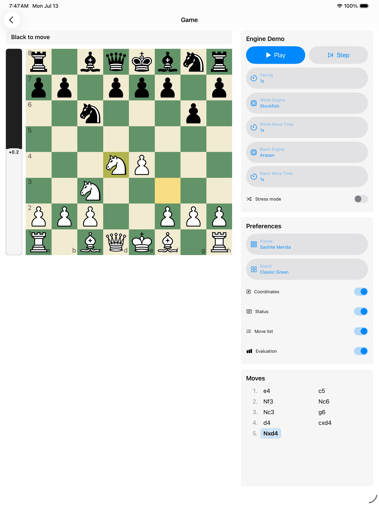
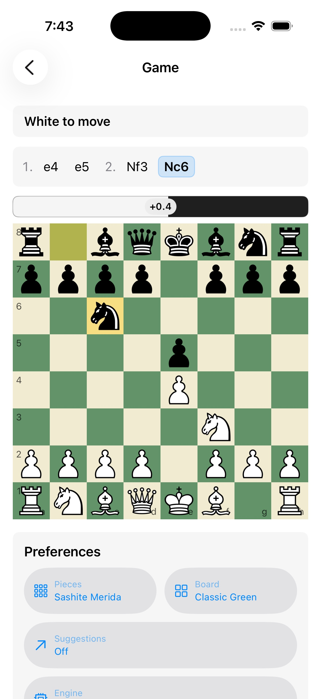

# SwiftChessDemo

SwiftChessDemo is a demo app that demonstrates how to combine local chess
libraries into a realistic, shippable SwiftUI chess experience.
The code is intentionally small, readable, and heavily commented so you can
trace how each module contributes to the final behavior.
It is intended as a reference implementation for building an app with
SwiftChessTools, not as a minimal sample.

Licensing note: SwiftChessDemo's original source code is licensed under the MIT
License so it can be reused as reference app code. The default app target links
with Stockfish through `../StockfishEmbedded`; distributing that combined
Stockfish-linked app requires GPLv3 compliance. The app can also use the
permissively licensed `ArasanEmbedded` Swift package as a second embedded engine.
See `LICENSE`, `LICENSES/`, and `THIRD_PARTY.md` for details.

Releases are source-only. This repository does not publish a prebuilt app,
framework, library, or other binary artifact; users build the sibling source
checkouts and Swift package dependency locally.

## Screenshots

The demo is designed to show the same app-owned chess experience adapting
between regular-width iPad layouts and compact iPhone layouts.

<p>
  
</p>

<p>
  
</p>

## Setup

Development requires Xcode 26 on an Apple-silicon Mac. The app uses Swift 6
language mode and targets iOS 26. The current Arasan source snapshot
intentionally supports arm64 only, so an
x86_64 simulator build is not a supported configuration.

Public checkout layout:

SwiftChessDemo expects `SwiftChessTools` and `StockfishEmbedded` to be sibling
checkouts. It resolves `ArasanEmbedded` from GitHub through Swift Package
Manager. The parent folder can be any local directory; it does not need to be a
Git repo.

```sh
mkdir swift-chess-demo-dev
cd swift-chess-demo-dev

git clone https://github.com/Trickfest/SwiftChessDemo.git
git clone https://github.com/Trickfest/SwiftChessTools.git
git clone https://github.com/Trickfest/StockfishEmbedded.git
```

The resulting layout should be:

```text
swift-chess-demo-dev/
|-- SwiftChessDemo
|-- SwiftChessTools
`-- StockfishEmbedded
```

Required after clone: initialize the sibling `../StockfishEmbedded` checkout
using its NNUE setup instructions. Those Stockfish neural-net files are not in
Git because they are large, but they are required to run the engine.

```
(cd StockfishEmbedded && Scripts/download-nnue.sh)
```

See `../StockfishEmbedded/README.md` or
`../StockfishEmbedded/Resources/NNUE/README.md` for the authoritative engine
asset setup. SwiftChessDemo intentionally does not duplicate the exact NNUE
filename because it changes when StockfishEmbedded updates vendored Stockfish.

### Physical-device signing

The public project does not select an Apple Developer Team. Simulator builds
need no signing setup. To run on an iPhone or iPad, create the ignored local
configuration and enter the Team ID for your own Apple Developer membership:

```sh
cp Configurations/Signing.local.xcconfig.example \
  Configurations/Signing.local.xcconfig
```

Then replace `YOUR_TEAM_ID` and `YOUR_REVERSE_DNS_PREFIX` in
`Signing.local.xcconfig`. The prefix must be one you control, such as
`com.example.yourname`, because Apple bundle identifiers are unique to a
developer account. Even an individual developer membership has a Team ID; the
term does not imply that multiple people work on the project. Keep this
account-specific file uncommitted. Use it instead of changing the Team or
Bundle Identifier fields in Xcode, which may write target-level overrides into
the shared project file.

How it all fits together:
- `ChessCore` owns board state, legal move generation, move application, PGN
  parsing, FEN serialization, SAN move records, game status, and draw claims.
- `ChessUI` renders the board and emits user move gestures. It also supplies
  the visible chessboard components used by the demo: piece sets, board
  themes, coordinate labels, `ChessGameStatusView`, `ChessMoveListView`,
  `ChessEvaluationBar`, and app-supplied `ChessBoardArrow` suggestions.
- `ChessUCI` formats UCI command strings and parses `info` and `bestmove`
  lines into typed values.
- SwiftChessDemo owns app policy: view-model state, engine timing, move-provider
  selection, user display preferences, recoverable engine status feedback,
  error handling, and when validated moves should mutate the game.
- `StockfishMoveProvider` and `ArasanMoveProvider` adapt their native wrappers
  to one shared app-local session that owns ordered output delivery, UCI
  handshake/readiness barriers, serialized searches, bounded timeouts, and
  coordinated off-main teardown.
- `ScenarioReplayMoveProvider` supplies deterministic non-live-engine moves for
  scenario replay and scenario-backed tests.
- The sibling `../StockfishEmbedded` project supplies engine moves over the UCI
  protocol via `SFEngine`.
- The `ArasanEmbedded` Swift package supplies an alternative engine over the UCI
  protocol via `ArasanEngine`.

Data flow at a glance:
- User moves on the board -> `ChessUI` -> `GameViewModel.handleUserMove`.
- The move is validated/applied in `ChessCore`, then serialized to FEN.
- FEN is pushed back into `ChessUI` to update the board UI.
- Terminal game state and claimable draws are read from ChessCore's
  `Game.status` and draw-claim APIs, then rendered with `ChessGameStatusView`.
- Legal moves are also captured as `ChessMoveRecord` values before they are
  applied, so `ChessMoveListView` can render SAN without owning the game.
- When it is the engine's turn, the selected live engine provider uses
  `ChessUCI` to format the UCI `position` and `go` command strings sent to the
  embedded engine.
- Opponent searches start immediately after the user's move. SwiftChessDemo
  keeps a minimum visible thinking interval before applying very fast replies,
  but it does not add that interval on top of slower real searches.
- The selected live engine streams `info` lines through its provider, where
  `ChessUCI` parses them into White-positive evaluation values for
  `ChessEvaluationBar`.
- Live engine searches use UCI `go movetime`, so the selected move-time value is
  the engine's intended thinking budget. SwiftChessDemo also keeps an app-side
  safety timeout slightly above that budget, asks the engine to stop if needed,
  applies the returned `bestmove` when available, and uses the existing status
  display for a brief nonfatal notice before returning to the normal game
  status.
- When suggestions are enabled, SwiftChessDemo asks the selected engine for up
  to three MultiPV analysis lines on the human player's turn, caches the ranked
  first moves, and filters the visible ChessUI arrows according to the user's
  suggestion-count picker. ChessUI renders the arrows but does not decide which
  moves to suggest.
- The engine returns `bestmove`; `ChessUCI` parses it into a `ChessCore.Move`.
- Engine-vs-engine mode starts paused with default Stockfish-vs-Arasan
  settings. The game screen is the single place to choose White and Black
  engines, move-time budgets, pacing, and stress options before pressing Play
  or Step.
- Engine-vs-engine uses the same UCI `go movetime` search policy as
  human-vs-engine play. The app derives its safety timeout from the selected
  move time, so there is no separate user-facing timeout setting.
- Engine-vs-engine mode automatically claims ChessCore draw claims such as
  threefold repetition and the 50-move rule. Human-vs-engine games leave those
  claimable draws available to the player instead of ending automatically.
- Completed games keep the user on the game screen after the result alert is
  dismissed, so the final board and move history can still be inspected. In
  engine-vs-engine mode, the primary playback control becomes `Play Again` and
  restarts from the initial position while preserving the current demo settings.
- Engine-vs-engine stress mode can randomize the engine and/or move-time budget
  before each move within a configured range. Randomization happens before a
  search starts, never while an engine request is in flight, so the mode is
  useful for exercising engine switching and safety-timeout boundaries without
  changing the normal human-vs-engine game.
- Scenario replay uses a named JSON scenario plus a bundled PGN fixture. The
  PGN is parsed through `ChessCore.PGNSerializer`, concrete moves are held in
  memory, and the same move-application path updates the board, move list, and
  status UI without starting a live engine.

Reference-app boundaries:
- SwiftChessTools provides reusable chess building blocks; SwiftChessDemo shows
  one app-owned composition of those blocks.
- ChessUI renders app-supplied state. It does not decide legal policy, own the
  game model, run engines, choose suggestion moves, or apply moves on behalf of
  the app.
- ChessUCI formats and parses protocol text. It does not start an engine,
  serialize searches, choose move-time or MultiPV policy, or decide how
  analysis should affect UI.
- Stockfish integration lives in the default app target through
  `StockfishEmbedded`. That linked distribution must comply with GPLv3.
  `ArasanEmbedded` is also available from the same game screen as a
  permissively licensed engine option.
- The scenario system is an app-level test and demonstration harness, not a
  SwiftChessTools public API.

Key files to read:
- `SwiftChessDemo/ContentView.swift`: setup UI for choosing the game mode and
  human side before entering the game screen.
- `SwiftChessDemo/GameView.swift`: board UI, live piece-set, board-theme,
  engine-selection, and coordinate-label switching during play, visible ChessUI
  status and move-list components, status-row engine activity and timeout
  notices, optional evaluation-bar display, in-game engine move-time control,
  selectable move-suggestion arrows, engine-vs-engine playback controls,
  terminal-result handling, compact horizontal move-list layout on iPhone, and
  navigation flow.
- `SwiftChessDemo/GameViewModel.swift`: display state, safe move application,
  provider event handling, minimum-visible-thinking timing, recoverable timeout
  fallback, evaluation normalization, selected-engine MultiPV suggestion
  mapping, engine-vs-engine loop control, automatic draw-claim policy for
  engine-vs-engine games, engine-demo replay reset behavior, stress-mode
  randomization, and ChessCore game-status integration.
- `SwiftChessDemo/EngineDemoConfiguration.swift`: value types that describe
  engine-vs-engine mode, per-side engine/move-time settings, pacing, and
  optional deterministic stress randomization.
- `SwiftChessDemo/StockfishMoveProvider.swift`: thin Stockfish transport adapter
  and app-local facade over the shared embedded-engine session.
- `SwiftChessDemo/ArasanMoveProvider.swift`: thin Arasan transport adapter and
  app-local facade over the shared embedded-engine session.
- `SwiftChessDemo/EmbeddedEngineProviderSession.swift`: shared handshake,
  readiness, search serialization, timeout, ordered-output, and asynchronous
  native teardown policy for both embedded engines.
- `SwiftChessDemo/DemoEngineProvider.swift`: app-local engine abstraction and
  shared request/event models used by live engine providers.
- `SwiftChessDemo/GameScenario.swift`: scenario-file loading and PGN validation
  for deterministic replay fixtures.
- `SwiftChessDemo/GameScenarioIndex.swift`: bundled scenario catalog loading and
  validation used to catch scenario-resource drift.
- `SwiftChessDemo/GameMoveProvider.swift`: deterministic move-provider
  abstraction used by scenario replay and scenario-backed UI tests.
- `SwiftChessDemo/Scenarios/`: checked-in scenario index, JSON definitions, and
  PGN fixtures. `Docs/SCENARIOS.md` is the authoring guide.
- `SwiftChessDemoTests/GameScenarioUnitTests.swift`: fast unit coverage for
  scenario loading, index validation, deterministic move-provider behavior,
  live-analysis refreshes, and engine-vs-engine playback/restart/stress
  behavior.
- `SwiftChessDemoUITests/SwiftChessDemoUITests.swift`: UI coverage for available
  in-game piece-set selection, board-theme selection, coordinate-label toggling,
  live-engine selection, status, move-list, evaluation display options,
  selectable suggestion arrows, engine-vs-engine setup and game-screen controls,
  scenario replay including terminal-result dismissal, and four-full-move game
  flows from both white and black perspectives.

Automated tests:
- Run the expected comprehensive local gate from this repo root:

```sh
Scripts/validate.sh
```

- `Scripts/validate.sh` runs the app-hosted unit tests, the generic iOS Release
  build and its built-product assertions, and the complete simulator UI-test
  target. Set `SWIFT_CHESS_DEMO_SIMULATOR_DESTINATION` to use another installed
  arm64 simulator when needed.
- GitHub Actions is optional, manual-only, and does not run for pushes or pull
  requests. Dispatch it with `Scripts/run-github-ci.sh [branch-or-tag]`; the
  selected ref and workflow must already be pushed because the helper never
  commits or pushes.
- The hosted workflow checks out `SwiftChessDemo`, `SwiftChessTools`, and
  `StockfishEmbedded` as siblings, resolves `ArasanEmbedded`, downloads the
  Stockfish NNUE file, and invokes `Scripts/github-ci.sh`. That hosted script
  runs the app-hosted unit tests without simulator UI tests and verifies the
  generic iOS Release build. The UI suite remains local because hosted
  simulator UI tests are slower and more environment sensitive.
- Hosted validation is supplemental and nonblocking. A missing or failed run,
  including one GitHub cannot start because Actions credits are unavailable,
  does not mean the code failed validation; `Scripts/validate.sh` is the local
  gate.
- The shared local scheme includes both fast scenario unit tests and full UI
  tests. The unit tests run inside the demo app host so `Bundle.main` loads the
  same bundled scenarios the app uses at runtime.
- Scenario replay tests set `SWIFT_CHESS_DEMO_SCENARIO=<scenario-id>` and
  optionally `SWIFT_CHESS_DEMO_SCENARIO_REPLAY_DELAY=0`. Each scenario id maps
  to a JSON file in `SwiftChessDemo/Scenarios`; the JSON points at the PGN
  fixture that supplies the validated move list.
- The game-flow UI tests run named scenarios in `testDrivesWhite` or
  `testDrivesBlack` mode so one side is driven by UI-test taps while the
  scenario supplies the opposing replies. This keeps move-flow coverage
  deterministic without starting a live engine.
- The game-flow tests set `SWIFT_CHESS_DEMO_UI_TEST_ENGINE_MOVE_TIME_MS=250` to
  keep simulator runs fast. UI tests that exercise live engine replies can also
  set `SWIFT_CHESS_DEMO_UI_TEST_ENGINE_REPLY_DELAY=1.0` to reduce the visible
  thinking pause. Normal app launches do not set these flags and default to
  Stockfish unless the player selects Arasan from the game screen.
- Engine-vs-engine unit tests use fake engine providers to verify that Play,
  Pause, Step, per-side engine/move-time settings, safety-timeout propagation,
  automatic draw-claim policy, and seeded stress randomization behave
  deterministically without starting live engine processes.
- Engine-vs-engine UI coverage verifies that the setup mode keeps duplicate
  engine-demo controls off the setup screen, then launches into a paused game
  with demo-only playback controls visible and the normal live-game engine
  picker hidden.
- Evaluation-bar UI coverage can set `SWIFT_CHESS_DEMO_UI_TEST_EVALUATION`
  values such as `cp:85`, `mate:white:3`, or `mate:black:2` so the visual state
  is deterministic without live engine analysis.
- Suggestion-arrow UI coverage uses scenario-backed move suggestions plus
  optional `SWIFT_CHESS_DEMO_UI_TEST_SUGGESTION_ARROW_COUNT` values from `0`
  through `3` so rendered arrows are deterministic without live engine analysis.
- Scenario-index coverage sets `SWIFT_CHESS_DEMO_VALIDATE_SCENARIO_INDEX=1` so
  the app validates `Scenarios/index.json`, bundled scenario JSON files, and
  PGN loading through the same bundle path used at runtime.

Scenario files:
- `SwiftChessDemo/Scenarios/index.json` is the durable scenario catalog. It
  lists every scenario id, tags, purpose, selected metadata, and the PGN
  resource each scenario uses.
- Scenario JSON is the per-scenario test description: id, title, PGN resource,
  playback mode, optional perspective, optional stop ply, and expected-status
  notes.
- PGN remains the readable source of moves. SwiftChessDemo does not check in a
  normalized move-list artifact; it parses and validates the PGN on launch.
- Supported playback modes are:
  - `automaticReplay`: replay both sides without user input or a live engine.
  - `testDrivesWhite`: expose test-only buttons for White moves and let the
    scenario provide Black replies.
  - `testDrivesBlack`: expose test-only buttons for Black moves and let the
    scenario provide White replies.
- See `Docs/SCENARIOS.md` for scenario authoring steps,
  index-field expectations, and the manual launch environment variables.

Sibling dependencies:
- `../SwiftChessTools`: public sibling checkout that provides the `ChessCore`,
  `ChessUI`, and `ChessUCI` Swift package products.
- `../StockfishEmbedded`: public sibling checkout that provides the
  `SFEngine-iOS` Xcode project product.
- `ArasanEmbedded`: public Swift package dependency resolved from GitHub that
  provides the `ArasanEmbedded` product.
- The parent folder can be any local directory; it does not need to be a Git
  repo.
- Because the two sibling dependencies are source checkouts rather than pinned
  package references, coordinated release notes should record the tested
  SwiftChessTools and StockfishEmbedded tags. Release those siblings before
  tagging SwiftChessDemo.
- Reference details live in `THIRD_PARTY.md`.
